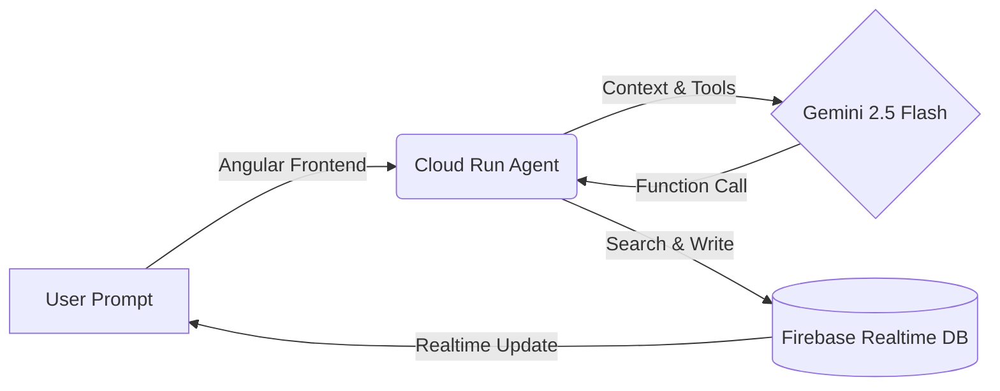

FuelFlow AI: Agentic Logistics Manager 🚀

Winner/Participant at Build and Blog Marathon 2025
Accelerating Wholesale Logistics with Agentic AI.

(Add a GIF of your AI agent handling a complex transaction here)

## 💡 The Problem

For local LPG wholesalers, managing inventory, sales, and empty tank returns is a logistical nightmare.

Tedious Data Entry: Staff spend hours filling out complex forms for every single sale or return.

Inventory Leaks: Tracking how many empty cylinders are pending return from specific customers is difficult manually.

Time Critical: In a fast-paced distribution center, stopping to navigate 5 different screens to log one transaction slows down operations.

## 🤖 The Solution

FuelFlow AI is an Intelligent Command Center integrated directly into the FuelFlow ERP. It replaces navigating multiple complex forms with simple natural language prompts.

Instead of manually selecting a customer, adding items, checking stock, and assigning a delivery person, a manager can simply type (or say):

"Logged 50 commercial cylinders sold to Hotel Paradise delivered by Suresh."

The AI understands the business logic, calculates the totals, updates the inventory, and logs the pending returns automatically—reducing a 2-minute task to 5 seconds.

## 🏗️ Architecture

The system uses a **Hybrid Architecture** combining a reactive Angular frontend with a scalable Serverless Python "Brain".

Tech Stack

Frontend: Angular 16+, Web Speech API (Optional Voice Input).

Backend "Brain": Python FastAPI, hosted on Google Cloud Run.

AI Model: Google Vertex AI (Gemini 2.5 Flash).

Database: Firebase Realtime Database (NoSQL).

Orchestration: Custom Tool Definitions & Function Calling.

✨ Key Features

1. ⚡ Rapid Data Entry via Natural Language

Replaces multi-step form wizards with a single prompt. The AI handles the complexity of distinguishing between:

Sales (OUT): "Sent 10 units to Rakesh."

Returns (IN): "Received 5 empties from Rakesh."

Mixed Transactions: "Delivered 10 filled, collected 10 empty."

2. 🔍 Intelligent Context Search

The AI doesn't just process text; it understands your business entities.

Customer Lookup: It fuzzy-searches "Rakesh" to find the specific userId and shippingAddress.

Staff Assignment: It links the transaction to the correct Delivery Person automatically.

Product Resolution: It maps "14KG" to the correct inventory SKU.

3. 📊 Business Intelligence & Tracking

By standardizing data entry through AI, FuelFlow maintains accurate records for:

Sales Performance: Tracking purchase frequency of specific customers.

Asset Management: Knowing exactly how many empty tanks are pending return from each client.

🛠️ The "Agentic" Workflow

We utilized Gemini Function Calling to give the model real-world tools:

Tool Name

Description

process_transaction

Logs complex nested transactions. Distinguishes between the Customer (Buyer) and the Delivery Person (Staff).

get_customer_details

Fetches full profile data (Address, Phone, ID) for a specific name.

refresh_memory

Forces the backend to re-fetch and cache the latest customer list from Firebase.

🚀 Installation & Setup

Prerequisites

Node.js & Angular CLI

Python 3.11+

Google Cloud Project with Vertex AI enabled

Firebase Project

1. Frontend (Angular)

cd fuel-flow-web
npm install
ng serve
# Open http://localhost:4200

2. Backend Agent (Cloud Run / Local)

cd backend-agent
pip install -r requirements.txt

# Run locally
python -m uvicorn main:app --host 0.0.0.0 --port 8080

3. Deployment

# Build & Deploy to Cloud Run
gcloud builds submit --tag gcr.io/YOUR_PROJECT_ID/cylinder-agent
gcloud run deploy cylinder-agent --image gcr.io/YOUR_PROJECT_ID/cylinder-agent --allow-unauthenticated

📸 Screenshots

Natural Language Interface

Realtime Database Update

User typing a complex transaction

Nested JSON created instantly

🏆 Impact

90% Reduction in time spent on data entry tasks.

Minimized Human Error: No more clicking the wrong dropdown or selecting the wrong product ID.

Real-time Asset Tracking: Immediate visibility into where every cylinder is located.

Built with ❤️ at the Google Cloud Build & Blog Marathon, Hyderabad.